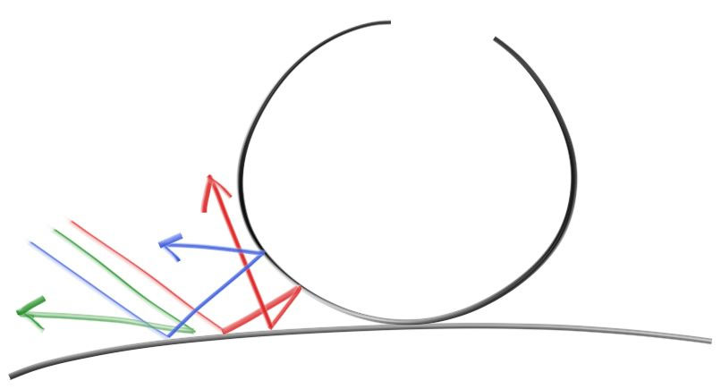
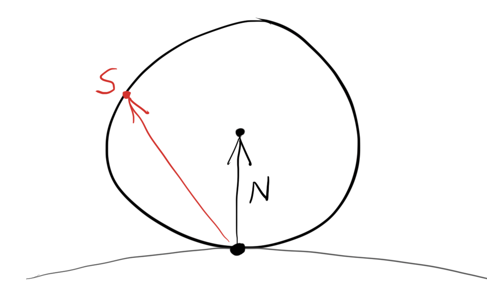

# Chapter 07

### Light ray bounces

### Generating a random diffuse bounce ray

There are two unit radius spheres tangent to the hit point pp of a surface. These two spheres have a center of `(P+n)` and `(P−n)`, where `n` is the normal of the surface. The sphere with a center at `(P−n)` is considered *inside* the surface, whereas the sphere with center `(P+n)` is considered *outside* the surface. Select the tangent unit radius sphere that is on the same side of the surface as the ray origin. Pick a random point `S` inside this unit radius sphere and send a ray from the hit point `P` to the random point `S` (this is the vector `(S−P)`)

### Limiting the Number of Child Rays

Use `depth` to limit the number of times of reflection.

### Using Gamma Correction for Accurate Color Intensity

Raise the color to the power `1/gamma`.

### Fixing Shadow Acne

 Some of the reflected rays hit the object they are reflecting off of not at exactly `t=0`, but instead at `t=−0.0000001` or `t=0.00000001` or whatever floating point approximation the sphere intersector gives us. So we need to ignore hits very near zero by setting `tMin` slightly bigger than 0.

### True Lambertian Reflection

* **Rejection**: Pick a random point in the unit cube where x, y, and z all range from −1 to +1. Reject this point and try again if the point is outside the sphere. (scales by the cos3(ϕ))
* **True Lambertian**: Pick points on the surface of the unit sphere, offset along the surface normal.  (scales by the cos(ϕ))

### Output Display

A  normals-colored sphere above ground with anti-aliased pixels 

